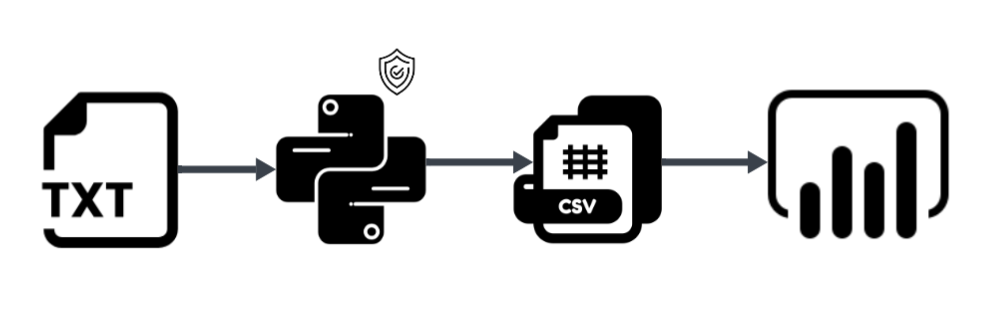
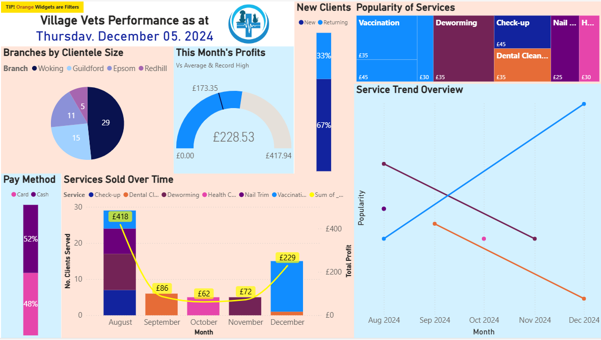

# Village Vets Data Visualisation Project
#PowerBI #BusinessAnalytics #DataVisualisation #DataBase #DataGovernance

## Overview
[Veterinary Data](./vet-sales-data.txt) from a local business in Greater London was provided by Generation Ireland for a quick turnover assignment. 
The main tasks were as follows:
(i) perform data cleaning and anonymisation (python) and visualisations for extracting insights and market intelligence (PowerBI)
(ii) propose a local database system and present to a non-technical client (max: 15 minutes)
Note: The data provided was purposefully simple (~60 rows) as the focus was not on statistical depth but analytical reasoning and process. 

## Questions 
What is the best way to visualise and analyse:
- Profits over time by store
- Customer buying habits (what was purchased and how often)
- Payment methods
- Any additional insights

## Data Pipeline

Focus on minimilism (as requested by client).  
Anonymisation performed at earliest point of ingestion (python)

## Deliverables
### Python Code
[Data Wrangling](./vet-anonymisation.py)  
Bonus: One of the columns had an unknown value so I made an assumption based on this [investigation](./sidequest.py)
### Dashboard
[Input (.csv) here](./vet_BI.csv)

[Download it here](./VetDashboard.pbix)
### Presentation
[Presentation Preview](./presentation-preview.png)
[Download PowerPoint on analytical reasoning and process proposals](./VetPresentation.pptx)  
__Note: I actually like presenting and this project was especially fun for me as a pet owner and sibling of a veterinary nursing student  
so if you are a recruiter, feel free to ask me for a live presentation!__  
Duration: 12 minutes

Here was the [feedback](./feedback.md) I was given and I am carrying this advice with an eagerness to improve as an associate data analyst!
